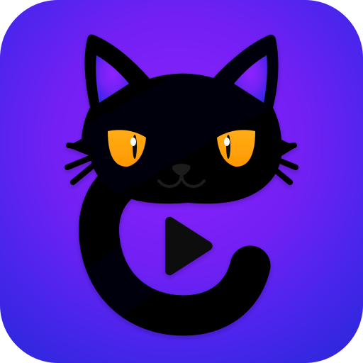

<h1 align="center">OneTrackCat</h1>

<p align="center">
  
</p>

<p align="center"><strong>OneTrackCat — the one trick you need to turn gameplay into highlights.</strong></p>

OneTrackCat is a local gameplay video editor for Linux. Remove quiet stretches, repeat the
best moment, slow down or zoom the action, add text and reaction media, and export a finished
video without an account or an upload.

## What you can do

- Cut out unwanted moments with a few marks.
- Replay a highlight, change its speed, zoom it, or freeze a frame.
  Replay repeats the footage at half speed and carries over face blur. Other effects aren't copied, but text and effects spanning the replay stay active.
- Add text, pictures, GIFs, reaction videos, sounds, and simple transitions.
- Make a regular landscape video or a 9:16 Short.
- Blur, pixelate, or mask faces with the optional local face pack.
- Undo and redo your editing.

## Requirements

- Ubuntu 26.04
- GNOME running on Wayland
- A 64-bit computer

OneTrackCat is currently developed and tested for this setup. Other Linux desktops, X11,
Windows, and macOS are not supported at this time.

## Install and open OneTrackCat

1. Download the OneTrackCat AppImage from [Releases](https://github.com/mstasenko/one-track-cat/releases).
2. In Files, right-click the AppImage and choose **Properties**.
3. Open **Permissions** and enable **Allow executing file as program**.
4. Close the Properties window and double-click the AppImage.

Run OneTrackCat as your normal user. You do not need `sudo` or an administrator account.

## Optional media packs

The media pack adds ready-to-use reaction images, clips, and sounds. The face pack adds the
**Blur faces** effect. Download either archive from Releases and extract it beside the AppImage.

```text
one-track-cat/
├── OneTrackCat-...AppImage
├── meme/
└── face-pack/
```

You can use OneTrackCat without either pack and add your own media with **New**. The packs are
optional downloads; their included files and licenses are listed in their manifests.

## A simple editing workflow

1. Drop a gameplay video into OneTrackCat or choose **Open**.
2. Move the playhead and add marks around a moment.
3. Click inside a section, then choose **Remove Marked**, **Speed**, **Zoom**, **Freeze**, or **Replay**.
4. Add text, a picture, a reaction clip, or a sound from the side panel.
5. Choose **Export**, select a destination, and wait for the finished video.

In the video chooser, hover over a clip for a short, silent preview. **Browse…** opens
the usual file dialog. **Clear Marks** removes only the highlighted section's boundary
marks, without deleting any video.

Search **Images** for local pictures, blank templates from
[MemeFact on Hugging Face](https://huggingface.co/datasets/sergiogpinto/memefact-templates)
and [Imgflip](https://imgflip.com/api), and ready-made captioned memes from
[IMKG](https://memes.science/). You can search their captions, too. **Videos** searches local
clips and animated Imgflip memes. Online matches appear in the same list with a small
globe. Hover to preview, click the name to download and add it, or click the globe to visit
its source. Selected templates stay on your computer for later editing. If a service is
unavailable, choose **Retry online search**. Your videos and project are never uploaded.
Memes and templates have their own usage rights; check the source before publishing, especially for
commercial use. No account or paid API is needed.

Effects apply to the section containing the playhead when marks are present. With no marks,
they apply to the entire video.

Choose **Effects → Transition** to fade or blur a section. Pick an effect and **In** or **Out**;
the effect uses the selected section's full duration.
After inserting a video, the playhead moves to its end so you can insert the next clip there.
Inserted-video transitions overlap the two clips while both play, shortening the combined
video by the overlap duration. Long transitions automatically fit the clips.

### Face blur

Choose **Effects → Blur faces**, choose a style, and click **Apply face blur**. OneTrackCat renders
a preview of the selected section, or the whole video when there are no marks. The rendered
result appears in the main preview while the playhead is inside that range; move outside it to
see the original video again. OneTrackCat keeps the current position and stays paused after the
render finishes, so no separate preview window opens or starts playing by itself.
The latest rendered preview is restored when you reopen an unchanged project, as long as
its cached video is still available. If it is unavailable, use **Apply face blur** again.
To edit an existing face-blur range, click its **Face blur** band in the timeline; this selects
its settings without moving the playhead.
Face-blur ranges appear on the timeline. Export reuses the preview's face analysis when the
footage and detection settings have not changed during the same app session. Export still
needs to apply the effect and encode the finished video.

- **Sensitivity** balances missed faces against extra detections.
- **Small faces** looks for smaller faces and may take longer.
- **Hold missed faces** keeps a face covered briefly if detection misses a frame.
- **Strength** and **Style** control how strongly the face is hidden.

Automatic detection can miss faces; check the preview before sharing.

If hardware processing is unavailable or a permission prompt is declined, OneTrackCat falls back
to CPU processing. Your project and media stay on your computer.

## Saving your project

OneTrackCat autosaves the open project while you work, before export, and when it closes normally.
Use **Project → Reset project** to forget the saved project and start over. Exported videos are
ordinary files in the folder you choose.

## Keyboard shortcuts

| Key | Action |
| --- | --- |
| Space | Play or pause |
| Left / Right | Move five seconds |
| Shift+Left / Shift+Right | Previous / next frame |
| Mouse wheel over the timeline | Zoom the timeline |
| Delete | Remove the selected item or marked section |
| Ctrl+Z | Undo |
| Ctrl+Shift+Z | Redo |

Shortcuts are disabled while face blur is being applied or a video is being exported.

## Development

See [DEVELOPMENT.md](DEVELOPMENT.md) for developer setup, builds, tests, optional pack creation,
and implementation notes.

## License

OneTrackCat source code is licensed under [GPL-3.0-only](LICENSE). Optional media, face-pack
components, and bundled fonts retain the licenses listed in their manifests and license files.
